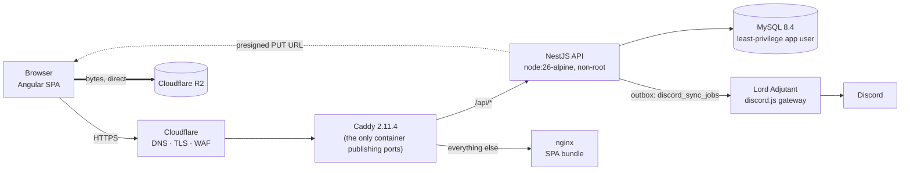

# Lords Dashboard — Backend API

> The REST API behind a _Holdfast: Nations At War_ clan's roster, events and recruitment site.

[](https://github.com/Amitoj02/lords-dashboard-backend/actions/workflows/ci.yml)
[](https://github.com/Amitoj02/lords-dashboard-backend/commits/main)
[](./LICENSE)
[](https://lordsofholdfast.com)

[](https://nestjs.com)
[](https://www.typescriptlang.org)
[](https://nodejs.org)
[](https://www.mysql.com)
[](./docker-compose.yml)
[](./CONTRIBUTING.md)

The Lords are a player clan in [**Holdfast: Nations At War**](https://store.steampowered.com/app/589290/Holdfast_Nations_At_War/) — Anvil Game Studios' Napoleonic-era multiplayer shooter, where 150 players hold rank-and-file formation on a single server and trade musket volleys over proximity voice chat. Clans in that game are called **regiments**, which is where this project's name comes from and why every noun in the codebase sounds like it was written in 1812: a rank ladder, a medal cabinet, a service record, a chain of command, a Colonel who is in fact a person with elevated permissions in a Discord server. That is the game's period vocabulary, adopted wholesale by the people who play it.

Underneath the costume it is an ordinary NestJS + TypeORM + MySQL service — Discord OAuth sign-in, membership, promotions, an events calendar with RSVPs, a recruitment queue, a media gallery, and an audit log over the lot. It has been running the real thing at **[lordsofholdfast.com](https://lordsofholdfast.com)** since **2026-07-20**, and it is now open source.

## 👋 Welcome

This repository is public because gaming communities keep rebuilding the same website. If you run a clan, a guild, a crew or a raid team, you have probably wanted some subset of _sign in with Discord → who's on the roster → what's the schedule → who RSVP'd → who let that person in_. This is one complete, shipped, in-production answer to that, with the reasoning written down.

You are welcome here whether you want to:

- **Read it.** The interesting parts are commented with _why_, not _what_. Start with [`SCHEMA.md`](./SCHEMA.md) and [`docs/INFRASTRUCTURE.md`](./docs/INFRASTRUCTURE.md).
- **Run it.** Two commands and a mocked Discord — no accounts, no keys, no cloud. See [Quickstart](#-quickstart).
- **Borrow from it.** Lift the capability matrix, the transactional Discord outbox, or the two-tier seeding rule into your own project. It's MIT.
- **Fork it for your own community.** It is single-tenant by configuration but multi-tenant by shape — every domain row already carries a `regiment_id`.
- **Contribute.** First PR ever? Genuinely fine. [Contributing](#-contributing) lists four concrete, real places to start.

You do not need to know Holdfast, or NestJS, or anything about the Lords.

### The other half

|                            | Repo                                                                                        | Stack                                         |
| -------------------------- | ------------------------------------------------------------------------------------------- | --------------------------------------------- |
| **Backend (you are here)** | [`Amitoj02/lords-dashboard-backend`](https://github.com/Amitoj02/lords-dashboard-backend)   | NestJS 11 · TypeORM · MySQL 8.4 · Discord bot |
| **Frontend**               | [`Amitoj02/lords-regiment-dashboard`](https://github.com/Amitoj02/lords-regiment-dashboard) | Angular · Bootstrap 5.3 · SCSS                |

The two repos are halves of one product and are deployed together. This repo's `docker-compose.yml` builds the `web` service from `context: ../lords-regiment-dashboard`, so they are expected **side by side on disk**:

```
~/Repositories/
├── lords-dashboard-backend/
└── lords-regiment-dashboard/
```

If you are changing an API contract, read the SPA's `src/app/core/services/` and `src/app/core/models/` rather than guessing what the client wants — they are the authoritative statement of what this API is expected to return.

---

## 🏛 Architecture at a glance



Four things worth knowing before you read any code:

- **Single origin, no CORS in production.** The SPA's `apiBaseUrl` is the relative string `/api`, so Caddy serves both halves from one hostname and the Discord OAuth callback is same-site. The API is deliberately _not_ split onto an `api.` subdomain.
- **Uploaded bytes never touch the API.** `POST /api/storage/uploads` validates target, MIME type, size and capability, then returns a presigned S3/R2 `PUT`; the browser uploads directly. MinIO stands in for R2 locally.
- **All Discord work goes through a transactional outbox** (`discord_sync_jobs`), drained by a worker on a 3-second tick with retry backoff. `discord.js` is confined to one boundary file.
- **Single-tenant, multi-tenant-shaped.** One regiment runs on an instance, but every domain row carries `regiment_id` and the permission matrix is stored per regiment.

---

## 🎖 What it does for the people using it

Picture a regular week in a Holdfast regiment, and this is the software underneath it:

- **Somebody wants to join.** They land on the public site, read the regiment's pitch, and sign in with Discord. That does _not_ put them on the roster — it just gives them an identity. They fill in enlistment papers (in-game name, preferred classes, how they found the unit), and the application drops into an officers' review queue where it can be approved, held, declined, or the applicant blocked. Approve it and they are enlisted at the entry rank.
- **Rank means something.** The seeded ladder runs twelve deep — General, Colonel, Major, Captain, Lieutenant, Sergeant, Corporal, Private First Class, Private, Recruit, Mercenary, Applicant — and each rung can be wired to a Discord role, so a promotion in the dashboard becomes a role change in the Discord server without anyone editing the member list by hand. Medals work the same way, with their own catalogue and precedence order.
- **Events are the point of the whole thing.** An officer schedules a line battle with a timezone-correct start, a recurrence cadence, platform tags and a game-server password. Members RSVP; reminders fire at the lead times the officer chose; the password is encrypted at rest and revealed only to people who actually said they were coming.
- **Afterwards, the clips.** Members submit screenshots, videos and YouTube/Medal.tv links to a gallery that moderators approve, tag and curate. Uploads go straight from the browser to object storage — the API only signs the request.
- **And somebody has to be accountable for it.** Every consequential action lands in an append-only audit ledger with actor, target, severity and a before/after snapshot, filterable and exportable as CSV. Members can export their own data and delete their own account, unassisted.

Everything above is gated by a **capability matrix** — 14 capabilities across 6 roles, stored in the database and editable from the admin UI, so the regiment can decide for itself whether a Sergeant may moderate the gallery.

### Modules

Fourteen controllers, all under the global `api` prefix. The table below is one row per _module_: **Authz** owns no routes at all (it is the guard everything else leans on), and **Gallery** contributes two controllers — the feed and a nested `media` resolver.

| Module                 | Directory                    | What it provides                                                                                                                                           |
| ---------------------- | ---------------------------- | ---------------------------------------------------------------------------------------------------------------------------------------------------------- |
| **Auth**               | `src/auth/`                  | Discord OAuth2 → JWT session, the `/auth/me` projection, logout with a server-side session cutoff, Discord guild-membership re-check                       |
| **Authz**              | `src/authz/`                 | The capability × role matrix engine — a `@RequireCapability()` guard over a cached `role_permissions` read                                                 |
| **Members**            | `src/members/`               | Roster directory, profiles, service record, event history, staff actions (rank/role, medals, suspend/ban), and GDPR self-service export + deletion         |
| **Applications**       | `src/applications/`          | Recruitment intake: self-submit and edit; staff queue with approve → enlist, decline, hold, block                                                          |
| **Events**             | `src/events/`                | Public + member calendars, create/edit, archive/complete/re-anchor, recurring series, RSVP, attendance, encrypted server-password reveal, three schedulers |
| **Gallery**            | `src/gallery/`               | Public feed, member archive, submissions, moderation queue, likes, and YouTube / Medal.tv link resolution into embed metadata                              |
| **Ranks** · **Medals** | `src/ranks/` · `src/medals/` | Admin-editable ladder and cabinet: CRUD, reorder by precedence, delete blocked while held/awarded, `Recruit` frozen against rename/delete, link and unlink to a Discord role |
| **Regiments**          | `src/regiments/`             | The three public, unauthenticated reads: regiment profile + presentation slice, legal documents, landing-page statistics                                   |
| **Settings**           | `src/settings/`              | Control panel: regiment profile, first-run setup, the editable authorization matrix, public presentation, legal documents, Owner-only dissolve             |
| **Discord**            | `src/discord/`               | The Lord Adjutant bot's control plane: connection status, guild role list, settings, full resync, bulk re-link progress, the bot-operations ledger         |
| **Storage**            | `src/storage/`               | Presigned upload issuance and the per-target policy the client reads for hints                                                                             |
| **Audit**              | `src/audit/`                 | Append-only ledger with actor/target/severity and before-after snapshots, filterable and CSV-exportable                                                    |
| **Health**             | `src/health/`                | `/health/live` (touches nothing), `/health/ready` (`SELECT 1`, 503 on DB down), and a legacy always-200 probe                                              |

---

## 🚀 Quickstart

**Prerequisite: Docker + Docker Compose.** That's genuinely it — no host Node, no host MySQL, and **no `.env` to write**. `docker-compose.yml` ships throwaway, Joi-valid development secrets so a fresh clone boots with zero hand-editing. ([`.env.example`](./.env.example) documents every variable and is the template for a _production_ deploy, not a prerequisite for running locally.)

```bash
git clone https://github.com/Amitoj02/lords-dashboard-backend.git
git clone https://github.com/Amitoj02/lords-regiment-dashboard.git   # sibling checkout

cd lords-dashboard-backend
docker compose up --build                    # api + MySQL 8.4 + MinIO + Angular web
docker compose exec api npm run db:setup     # first run only: create → migrate → seed
```

|                               |                                                          |
| ----------------------------- | -------------------------------------------------------- |
| SPA                           | <http://localhost:4200>                                  |
| API (proxied through the SPA) | <http://localhost:4200/api>                              |
| Swagger / OpenAPI             | <http://localhost:4200/api/docs> _(non-production only)_ |
| MySQL, for host tools         | `127.0.0.1:3307`                                         |
| MinIO console                 | <http://localhost:9101> (API on `:9100`)                 |

Run tooling inside the container: `docker compose exec api npm test`, `… npm run lint`, `… npm run migration:run`.

> **Only cloned the backend?** The `web` service builds from `context: ../lords-regiment-dashboard`, so without the sibling checkout that one service cannot build. Start just the API stack instead — everything in this repo works fine on its own:
>
> ```bash
> docker compose up --build db minio minio-init api    # API at http://localhost:3000/api
> ```

### Signing in without a Discord application

Discord is **mocked by default** — `DISCORD_MOCK` auto-enables whenever `DISCORD_CLIENT_ID` is empty, so the whole sign-in → JWT → `/auth/me` flow works offline. Pick a persona:

```
/api/auth/discord?as=owner     # full admin
/api/auth/discord?as=recruit   # non-member, lands on /apply
```

The `?as=` switch is honoured **only** while the mock is active, and production refuses to boot with the OAuth mock enabled unless someone has explicitly set `ALLOW_MOCKS_IN_PROD=true` — it is a literal auth bypass, and it is treated like one.

<details>
<summary><strong>Running the API on the host instead</strong> (the day-to-day loop most contributors use)</summary>

```bash
npm ci
docker compose up -d db minio minio-init    # MySQL 8.4 + object storage in containers
npm run db:setup                            # create → migrate → seed (all idempotent)
npm run start:dev                           # http://localhost:3000/api
```

`db:setup` is shorthand for `db:create && migration:run && seed`; all three are idempotent. The Docker images and CI both run **Node 26**, and `package.json` declares no `engines` field, so anything reasonably current will build.

There is also a [`.devcontainer/`](./.devcontainer/devcontainer.json) that attaches VS Code to the `api` compose service and forwards 3000 / 4200 / 3307.

If `npm run build` fails on a permissions error, it's a root-owned `dist/` left behind by a container bind-mount — build inside the container instead (`docker compose exec api npm run build`).

</details>

<details>
<summary><strong>Connecting a real Discord application</strong></summary>

Sign-in already works via the mock. To use a real Discord app:

1. Create an application at <https://discord.com/developers/applications>.
2. Under **OAuth2 → Redirects**, add the callback that matches **your topology** — this trips people up:
   - **Compose stack** (browser talks to the SPA origin, which proxies `/api`): `http://localhost:4200/api/auth/discord/callback` — this is what `docker-compose.yml` derives from `WEB_ORIGIN`.
   - **API alone on the host, no SPA proxy**: `http://localhost:3000/api/auth/discord/callback` — this is what `.env.example` ships as `DISCORD_CALLBACK_URL`.
   - **Production**: `https://<your-domain>/api/auth/discord/callback`.

   Whatever you register must match `DISCORD_CALLBACK_URL` exactly, or Discord returns `invalid redirect_uri`.

3. Set `DISCORD_MOCK=false` and copy the **Client ID** / **Client Secret** into `DISCORD_CLIENT_ID` / `DISCORD_CLIENT_SECRET`. No code changes — the mock and the real client share one interface (`DiscordOAuthService`). The requested scopes are `identify email`.
4. Optionally set `DISCORD_GUILD_ID` to your regiment's Discord server to record guild membership.
5. Generate the two secrets the app refuses to boot without:
   ```bash
   node -e "console.log(require('crypto').randomBytes(48).toString('hex'))"   # JWT_SECRET
   node -e "console.log(require('crypto').randomBytes(32).toString('hex'))"   # ENCRYPTION_KEY (exactly 64 hex chars)
   ```

`ENCRYPTION_KEY` is **not rotatable** — the column transformer carries no key id, so changing it permanently orphans every stored Discord token and event password. Generate it once, back it up, keep it.

Joi validates the whole environment at boot with `abortEarly: false`, so a missing or malformed variable fails the process immediately with the full list — not at 3am on the first request that needed it.

</details>

---

## 🔐 Authentication & authorization

**Identity vs. membership.** `discord_identities` is the canonical account record, created on first sign-in. A `members` row — the roster — is created **only when someone applies and is approved**, never on sign-in, so casual logins never pollute the roster. An identity with no linked member gets an identity-only session and the SPA routes it to `/apply`.

**Token handoff.** The JWT is delivered both as an httpOnly `access_token` cookie **and** in the redirect **URL fragment**. A fragment is never sent to a server, so the token stays out of edge access logs and out of the `Referer` header.

**Fresh authority on every request.** `JwtStrategy` trusts the token only for its stable `sub` / `did` claims and re-resolves role, regiment and member id from the database per request, rejecting any token issued before the identity's session cutoff — which `POST /auth/logout` advances, killing concurrent tokens. A demotion takes effect on the next request, not the next login.

**Two global guards**, in order: `JwtAuthGuard` (everything is protected; `@Public()` opts out), then `GuildGateGuard` (an optional Discord-guild-membership gate; `@AllowWhenGated()` opts out). Specific rights are then declared per route with `@RequireCapability()`.

**Capabilities, not roles.** Six roles — `Owner, Admin, Moderator, Member, Mercenary, Applicant` — mapped to 14 capabilities in the per-regiment `role_permissions` table, editable at runtime from the admin UI:

```
manage_settings        manage_roles          view_audit_log         edit_ranks_medals
manage_applications    manage_events         view_gallery           moderate_gallery
reveal_event_passwords submit_to_gallery     rsvp_to_events         view_members_directory
apply_to_join          manage_regiment_details
```

Two independent safety rails sit on the editable matrix. `assertGovernable()` is the **governance floor**: the Owner role can never lose `manage_settings` + `manage_roles`, and some role must always retain `manage_settings`, so a regiment cannot lock itself out of its own control panel. Separately, a set of privileged capabilities can never be granted to **Applicant**, because Applicant is the implicit role of every signed-in identity with no roster row — granting it a management right would hand that right to the entire internet.

---

## 🗺 Route map

Every path is prefixed with `/api` (configurable via `API_PREFIX`). Capabilities in the **Auth** column are checked by `@RequireCapability`. Swagger lives at `/api/docs` in non-production and is deliberately absent in production — an OpenAPI document is a free reconnaissance map.

<details>
<summary><strong>Auth</strong> — <code>/api/auth</code></summary>

| Method | Route                    | Auth           | Purpose                                                                           |
| ------ | ------------------------ | -------------- | --------------------------------------------------------------------------------- |
| GET    | `/auth/discord`          | public, 20/min | 302 to Discord with a CSRF `state` cookie                                         |
| GET    | `/auth/discord/callback` | public, 20/min | Exchange code, upsert identity (+ link member), issue JWT                         |
| GET    | `/auth/me`               | JWT            | The `CurrentUser` projection the SPA hydrates from                                |
| GET    | `/auth/guild-status`     | JWT            | The only endpoint that may ask the bot about the caller; 15-min cache, fails open |
| POST   | `/auth/logout`           | JWT            | Clears the cookie **and** advances the session cutoff                             |

</details>

<details>
<summary><strong>Public reads</strong> — no authentication at all</summary>

| Method | Route                                      | Purpose                                                                                        |
| ------ | ------------------------------------------ | ---------------------------------------------------------------------------------------------- |
| GET    | `/regiment`                                | Regiment profile + the `presentation` slice (landing/login banners, quotes, overlay densities) |
| GET    | `/regiment/documents`                      | Terms, privacy and community guidelines as Markdown; `body: null` = never edited               |
| GET    | `/regiment/stats`                          | Landing-page statistics                                                                        |
| GET    | `/events`, `/events/:id`                   | Public calendar                                                                                |
| GET    | `/gallery`, `/gallery/:id`                 | Approved gallery feed                                                                          |
| GET    | `/gallery/media/medal/:id/thumbnail`       | Medal.tv thumbnail proxy (60/min)                                                              |
| GET    | `/health/live`, `/health/ready`, `/health` | Probes                                                                                         |

The regiment routes are anonymous _because their consumers are logged-out surfaces_: the sign-in page and the legal pages are reached before authentication, so they cannot sit behind a capability gate.

Legal documents are stored as Markdown and are **not sanitised server-side** — the SPA renders them through a strict escape-first renderer, and that is the single security boundary. Please don't add a second, divergent sanitiser here.

</details>

<details>
<summary><strong>Members & GDPR</strong> — <code>/api/members</code></summary>

| Method | Route                                                              | Auth                            |
| ------ | ------------------------------------------------------------------ | ------------------------------- |
| GET    | `/members`, `/members/:id`                                         | `view_members_directory`        |
| GET    | `/members/:id/service-record`, `/:id/events`, `/:id/rsvps`         | `view_members_directory`        |
| GET    | `/members/:id/command-info`                                        | `view_audit_log`                |
| PATCH  | `/members/:id`                                                     | self-service                    |
| POST   | `/members/:id/rank`, `/:id/medals` · DELETE `/:id/medals/:medalId` | `edit_ranks_medals`             |
| POST   | `/members/:id/role`, `/suspend`, `/ban`, `/unban`, `/unsuspend`    | `manage_roles`                  |
| GET    | `/members/me/export`                                               | self-service (data export)      |
| POST   | `/members/me/deletion-request`, `/confirm`, `/execute`, `/cancel`  | self-service (account deletion) |

Admin actions on a _specific_ member are additionally gated on a server-computed `permittedActions` block, so the client's action menu cannot drift from what the API will accept.

</details>

<details>
<summary><strong>Applications</strong> — <code>/api/applications</code></summary>

| Method | Route                                                                            | Auth                  |
| ------ | -------------------------------------------------------------------------------- | --------------------- |
| POST   | `/applications` (10/min) · GET `/applications/mine` · PATCH `/applications/mine` | `apply_to_join`       |
| GET    | `/applications`, `/applications/:id`                                             | `manage_applications` |
| POST   | `/applications/:id/approve` · `/decline` · `/hold` · `/block` · `/unblock`       | `manage_applications` |

Approving enlists the applicant at the entry rank.

</details>

<details>
<summary><strong>Events</strong> — <code>/api/events</code></summary>

| Method      | Route                                                                                         | Auth                                                |
| ----------- | --------------------------------------------------------------------------------------------- | --------------------------------------------------- |
| GET         | `/events/mine`, `/events/mine/:id`                                                            | authenticated                                       |
| POST        | `/events` · PATCH `/events/:id` · POST `/:id/archive`, `/unarchive`, `/complete`, `/reanchor` | `manage_events`                                     |
| DELETE      | `/events/:id` · `/events/:id/series`                                                          | `manage_events`                                     |
| POST/DELETE | `/events/:id/attendees[/:memberId]`                                                           | `manage_events`                                     |
| POST/DELETE | `/events/:id/rsvp`                                                                            | `rsvp_to_events`                                    |
| GET         | `/events/:id/attendees`, `/events/:id/rsvps`                                                  | `view_members_directory`                            |
| POST        | `/events/:id/reveal-password`                                                                 | `reveal_event_passwords` (and you must have RSVP'd) |

</details>

<details>
<summary><strong>Gallery</strong> — <code>/api/gallery</code></summary>

| Method      | Route                                                     | Auth                                                         |
| ----------- | --------------------------------------------------------- | ------------------------------------------------------------ |
| GET         | `/gallery/archive`                                        | `view_gallery`                                               |
| GET         | `/gallery/moderation/queue`                               | `moderate_gallery`                                           |
| GET         | `/gallery/pending-summary`                                | `manage_events`                                              |
| POST        | `/gallery`                                                | `submit_to_gallery`                                          |
| POST        | `/gallery/:id/approve`, `/decline` · PATCH `/gallery/:id` | `moderate_gallery`                                           |
| POST/DELETE | `/gallery/:id/like` · DELETE `/gallery/:id`               | author-or-moderator, resolved in the service                 |
| GET         | `/gallery/media/resolve`                                  | authenticated — resolves a URL to embed + thumbnail metadata |

</details>

<details>
<summary><strong>Ranks, medals & Discord linking</strong></summary>

`/api/ranks` and `/api/medals` have an identical shape:

| Method | Route                                                                                            | Auth                |
| ------ | ------------------------------------------------------------------------------------------------ | ------------------- |
| GET    | `/`                                                                                              | authenticated       |
| POST   | `/` · PATCH `/:id` · DELETE `/:id` · POST `/reorder`, `/:id/link-discord`, `/:id/unlink-discord` | `edit_ranks_medals` |

Delete is blocked while a rank is held or a medal has been awarded. Linking a rank or medal to a Discord role holding `ADMINISTRATOR` / `BAN_MEMBERS` / `MANAGE_ROLES` and friends succeeds but comes back with a `discordRoleWarning` for the admin to see, and raises the audit row to `warn` — an `edit_ranks_medals` holder can reach real Discord authority this way, so the ledger says who did it. A role the bot genuinely *cannot* assign (above or equal to its own highest role, integration-managed, or absent from the guild) is still refused.

The **`Recruit` rank is protected**: `PATCH` refuses a rename and `DELETE` refuses outright, both 403, for every caller including the Owner. Approving an application resolves that rank *by name*, so removing or renaming it would break enlistment. Its precedence, insignia and Discord-role mapping stay editable, and `isProtected` on every rank projection tells the client which rows are frozen. The list lives in `src/ranks/protected-ranks.ts`, alongside the constant the enlistment path itself imports.

| Method | Route                             | Auth                                                                                           |
| ------ | --------------------------------- | ---------------------------------------------------------------------------------------------- |
| GET    | `/discord/roles`                  | `edit_ranks_medals` — guild role list for the link pickers                                     |
| GET    | `/discord/relink/:batchId`        | `edit_ranks_medals` — live progress or terminal summary of a bulk role re-link                 |
| POST   | `/discord/relink/:batchId/cancel` | `edit_ranks_medals` — stop expansion; already-applied members stay, the run reports as partial |

</details>

<details>
<summary><strong>Settings, audit, storage & bot control</strong></summary>

| Method         | Route                                                                                       | Auth                                                                        |
| -------------- | ------------------------------------------------------------------------------------------- | --------------------------------------------------------------------------- |
| GET/PATCH      | `/settings` · POST `/settings/complete-setup`                                               | `manage_settings`                                                           |
| GET/PATCH      | `/settings/permissions`                                                                     | `manage_settings` — the editable authorization matrix                       |
| GET/PATCH      | `/settings/presentation`                                                                    | `manage_regiment_details` — banners submitted as storage **keys**, not URLs |
| GET            | `/settings/documents` · PUT `/settings/documents/:slug`                                     | `manage_regiment_details` — `terms` \| `privacy` \| `guidelines`            |
| POST           | `/settings/dissolve`                                                                        | Owner role only, not a capability. Destructive                              |
| GET            | `/audit`, `/audit/:id`, `/audit/export` (CSV)                                               | `view_audit_log`                                                            |
| POST           | `/storage/uploads` (30/min) · GET `/storage/policy`                                         | per-target capability                                                       |
| GET/POST/PATCH | `/discord/connection`, `/verify-connection`, `/settings`, `/resync`, `/operations`, `/bind` | `manage_settings`                                                           |
| GET            | `/discord/status`                                                                           | Owner, Admin or Moderator                                                   |

`manage_regiment_details` is a **publishing** right, deliberately separate from `manage_settings` — it is the copy the whole internet sees, so it can be delegated to whoever writes it without also handing over the permission matrix and the bot configuration.

</details>

---

## 🧱 Engineering notes

Nothing here is exotic, but several decisions are load-bearing and worth knowing before you change them.

**Stack.** NestJS 11 (modules, DI, guards, pipes, interceptors, filters) · TypeORM 0.3 + `mysql2` with a snake_case naming strategy · MySQL 8.4 · Passport JWT + Discord OAuth2 · `class-validator` / `class-transformer` · Swagger/OpenAPI · Joi env validation · Jest + Supertest · `discord.js` 14, confined to a single gateway file.

<details>
<summary><strong>Column encryption, soft deletes and short ids</strong></summary>

- **AES-256-GCM** column transformer (`src/common/crypto/encryption.transformer.ts`): 12-byte random IV per value, stored as `base64(iv).base64(authTag).base64(ciphertext)`. Applied to exactly three columns — the Discord access and refresh tokens on `discord_identities`, and the event server password (never projected except by `revealPassword`). Joi requires `ENCRYPTION_KEY` to be exactly 64 hex characters or the app will not boot.
- **Soft deletes** (`@DeleteDateColumn`) on four entities: regiments, events, gallery items and members. Audit rows are retained and anonymised, never purged.
- **12-character base62 primary keys** (~71 bits) minted on insert by a global TypeORM subscriber, with `@IsShortId()` / `ParseShortIdPipe` in place of the UUID equivalents, so nothing sequential or guessable appears in a URL. A small retained-opaque set stays UUID on purpose: the identity id (it is the JWT `sub` and never appears in a URL), sync-job ids, and the GDPR confirmation token.

</details>

<details>
<summary><strong>The capability matrix cache</strong></summary>

`AuthzService` memoises the per-regiment matrix with a **30-second TTL**. That is deliberate, not laziness: migrations and `seed:prod` write `role_permissions` out-of-band and cannot call `invalidate()`. Without a TTL those changes stay invisible until the process restarts, and the failure is silent _and_ self-contradictory — `GET /settings/permissions` reads the table and reports a capability as granted while the guard reads the stale cache and denies it. Thirty seconds bounds that window without making the matrix a per-request query.

(The practical consequence while developing: reseed while the API is running and you may see exactly that mismatch for up to 30 seconds.)

</details>

<details>
<summary><strong>The Discord outbox worker</strong></summary>

Every Discord side effect — role change, announcement, onboarding DM — is written to `discord_sync_jobs` in the same transaction as the domain change, then drained by `DiscordSyncWorker` on a **3-second tick**, `BATCH_SIZE = 20`, retry backoff `[5s, 30s, 2m, 10m, 30m]`. `BULK_SLOTS_PER_TICK = 12` is reserved so a 600-member role re-link cannot starve a time-sensitive announcement. Bulk re-links use a self-re-enqueuing cursor job (`RELINK_PAGE_SIZE = 50`) so memory stays flat, the run resumes after a restart, and the operator gets a cancel point between pages. `IDEMPOTENT_JOB_TYPES` gates which jobs may be re-run after an orphaned restart.

The bot sits behind **two independent switches**:

1. **`DISCORD_BOT_MOCK`** (environment; defaults on when there is no `DISCORD_BOT_TOKEN` outside production). When set, a mock gateway replaces the real one — no `discord.js` `Client` is constructed and there is zero network I/O.
2. **`botEnabled`** (a database flag on `discord_bot_settings`, seeded `false`, flipped from the admin UI). Nothing is enqueued or applied until it is on.

Even Discord's permission bits are redeclared locally as bigints so the dependency stays contained. There are **no Discord webhooks anywhere** — every outbound message goes through the bot token via that MySQL-backed outbox.

</details>

<details>
<summary><strong>Uploads and storage policy</strong></summary>

Nine upload targets, each with its own MIME allowlist, size cap and required capability. Rank and medal icons are PNG + WebP only and dimension-capped at 250 px per side — SVG was removed because a scripted SVG navigated directly on the CDN subdomain would execute. The S3 client pins `checksumCalculation` / `responseChecksumValidation` to `WHEN_REQUIRED` so MinIO in development and Cloudflare R2 in production share exactly one code path.

</details>

<details>
<summary><strong>Schedulers, rate limits and hardening</strong></summary>

**Three background schedulers**, all `unref()`-ed interval timers with fully guarded ticks that log and swallow every failure: an event-status sweep (60 s, `upcoming → ongoing → previous`), recurrence materialisation (5 min, 60 days ahead, Luxon for timezone-correct anchoring), and lead-time reminders (60 s) that claim each row with a conditional `UPDATE … WHERE sent_at IS NULL` _before_ enqueuing, so at-most-once survives a restart mid-deploy.

**Rate limiting** is global at 120 requests/minute, with tighter per-route caps on the OAuth routes (20/min), application submission (10/min), uploads (30/min) and the thumbnail proxy (60/min). `CfAwareThrottlerGuard` keys on `CF-Connecting-IP` **only** when `TRUST_CF_CONNECTING_IP=true`, because that header is client-suppliable — trusting it is safe only once ingress is provably CDN-only. Otherwise it falls back to the unforgeable socket peer IP.

**Hardening you'll meet while reading `main.ts`:** `helmet()` and `cookieParser()`; a middleware installed **before routing** that sets `Cache-Control: no-store` on every response by default, so the few genuinely cacheable handlers must opt out explicitly; a `ValidationPipe` with `whitelist` + `forbidNonWhitelisted` + `transform`, so an unknown property is a 400 rather than a silent drop; explicit-origin CORS with credentials; `NODE_ENV` required with no default, because a typo must not silently degrade to `development` (which would mount Swagger and drop the cookie `Secure` flag); Swagger gated out of production with `SWAGGER_ENABLED=true` as the staging override; a boot guard that **refuses to start production** while the OAuth mock is active without `ALLOW_MOCKS_IN_PROD=true`; and `enableShutdownHooks()` so the Discord gateway logs out cleanly and the schedulers stop on `SIGTERM`.

The audit ledger records as a **side effect**: a failure there is logged and swallowed so it can never break the caller.

</details>

---

## 🗄 Database

The complete normalized (3NF) model — 29 tables, enums, junctions, soft deletes, the authorization matrix and the auth/identity model — is documented in **[`SCHEMA.md`](./SCHEMA.md)**.

`synchronize` is hardcoded `false` and must stay that way. Schema changes are made by editing an entity and generating a migration; **five** migrations exist today, the first being a squash of the original eighteen — so a database that ran those must be **dropped and recreated, not migrated forward**. All date columns are `datetime(6)` rather than `timestamp`, avoiding both the 2038 cap (events are scheduled into the future) and implicit timezone conversion.

> [!IMPORTANT]
> **`seed:prod` runs on every production deploy, so seeding is two-tier.** "Idempotent" is not enough: re-applying a hardcoded default to a row an admin has since edited is idempotent _and_ destructive.

| Tier                                  | Runs                                      | Contains                                                                                                                    |
| ------------------------------------- | ----------------------------------------- | --------------------------------------------------------------------------------------------------------------------------- |
| **1 — code-owned reference catalogs** | every deploy                              | `seedAccentTones`, `seedAuditActions` — immutable keys, where the seed file _is_ the source of truth                        |
| **2 — greenfield provisioning**       | only when the regiment row does not exist | `seedRegiment`, `seedRanks`, `seedMedals`, `seedDiscordBotSettings`, `seedDevOwner` — anything an admin can edit afterwards |

`seedRolePermissions` is the deliberate exception: it runs in both cases, but insert-only per `(role, capability)` **enum** pair. Enum members cannot be renamed by a user, so a capability added in a later release back-fills its default grant on an existing database while every admin edit survives. That trick is _not_ safe for ranks or medals, whose natural keys are user-editable.

**Consequence:** a tier-2 seeder will never run against the existing production database. To change data on a live deployment, write a migration. **Adding a seeder means choosing a tier — the tests will not choose for you.** Full reasoning in [`CONTRIBUTING.md`](./CONTRIBUTING.md) and the docstring at the top of `src/database/seeds/main.seeder.ts`.

---

## 🧪 Testing

```bash
npm test           # 39 unit specs — services, guards, DTO validation, schedulers, crypto
npm run test:e2e   # 8 Supertest suites, full HTTP round-trips against a real MySQL
npm run test:cov   # coverage
```

The e2e suites — `auth`, `mvp`, `post-mvp`, `discord`, `account-deletion`, `guild-membership`, `last-seen`, `member-hierarchy` — drive the real OAuth handshake (mocking only Discord's HTTP), proving that a new sign-in persists an encrypted identity record and a returning sign-in resolves the linked member.

> [!WARNING]
> **Run the e2e suite against an isolated database.** The suites share one database and mutate single-tenant rows (the permission matrix, bot settings), so `maxWorkers` is pinned to 1 and they will fight with your dev data. [`CONTRIBUTING.md`](./CONTRIBUTING.md) has the exact copy-pasteable command — including the one non-obvious detail, that `OWNER_DISCORD_ID=` must be **empty**, or the seeder treats the database as a real deploy and starts with setup incomplete.

CI (`.github/workflows/ci.yml`) runs two jobs on every branch push and every PR to `main` or `dev`:

- **Backend (lint · unit · e2e · build)** — lint → build → `db:setup` → unit → e2e, on Node 26 against a MySQL service container.
- **Docker images (api + web)** — builds both production images.

Every value CI needs is a committed throwaway constant. The backend job references no repository secrets at all, and no workflow uses `pull_request_target`, so a fork PR can neither read nor leak anything.

---

## 📜 NPM scripts

<details>
<summary>The full table</summary>

| Script                                                                       | What it does                                                                                 |
| ---------------------------------------------------------------------------- | -------------------------------------------------------------------------------------------- |
| `start` · `start:dev` · `start:debug`                                        | Run once · watch mode · watch with the inspector                                             |
| `build` · `start:prod`                                                       | `nest build` → `dist/`, then `node dist/main`                                                |
| `lint` · `lint:check`                                                        | ESLint with `--fix` / without (CI uses `lint:check`)                                         |
| `format` · `format:check`                                                    | Prettier write / verify                                                                      |
| `test` · `test:watch` · `test:cov` · `test:debug`                            | Unit tests (Jest, `src/**/*.spec.ts`)                                                        |
| `test:e2e`                                                                   | End-to-end tests (Supertest, `test/jest-e2e.json`)                                           |
| `db:create`                                                                  | Create the database if absent                                                                |
| `db:setup`                                                                   | `db:create && migration:run && seed` — all idempotent                                        |
| `migration:generate -- src/database/migrations/<Name>`                       | Diff entities → a new migration                                                              |
| `migration:create` · `migration:run` · `migration:revert` · `migration:show` | The rest of the migration lifecycle                                                          |
| `seed`                                                                       | Run `MainSeeder` (both tiers)                                                                |
| `typeorm`                                                                    | The TypeORM CLI entrypoint                                                                   |
| `migration:run:prod` · `seed:prod` · `db:setup:prod`                         | The same, from compiled JS with no `ts-node` — what the production `migrate` one-shot chains |

</details>

Anything above also runs in the container: `docker compose exec api npm test`, `… npm run lint`, `… npm run migration:run`.

---

## 🗂 Project structure

```
src/
├── main.ts, app.module.ts    # bootstrap + root module
├── config/                   # typed config + Joi env validation
├── common/                   # enums, crypto, guards, pipes, short ids, filters, dto
├── database/                 # data-source, migrations, seeds, scripts
├── auth/                     # Discord OAuth2, JWT strategy, guards, decorators
├── authz/                    # the capability × role matrix engine (@Global)
├── audit/                    # append-only ledger (@Global)
├── members/  applications/  ranks/  medals/  regiments/  settings/
├── events/   gallery/       discord/  storage/
└── health/                   # liveness + readiness probes
```

Everything else lives beside it: `test/` (e2e suites), `deploy/` (the production runbook and host-side scripts), `caddy/`, `mysql/`, `docs/`, `project-plan/`.

---

## 🚢 Running it in production

```bash
docker compose -f docker-compose.yml -f docker-compose.prod.yml up -d --build
```

The whole product runs as a Docker Compose stack on a single OVHcloud VPS behind Cloudflare, owned by an unprivileged `deploy` user. GHCR images only — nothing is built on the box. A one-shot `migrate` container runs `migration:run:prod && seed:prod` from compiled JS and must exit successfully before the API starts (`condition: service_completed_successfully`). Caddy is the only container that publishes ports; it terminates TLS, sets HSTS/CSP/security headers, and routes `/api/*` to the API and everything else to the SPA. The API image is `node:26-alpine`, runs as the non-root `node` user, and connects as a DML-only database account — the DDL account belongs to the migrate one-shot and is gone before traffic arrives.

**Deploys are manual by design.** Merging to `main` in either repo builds and pushes an image to GHCR and changes nothing live; a human then dispatches the `Deploy to production` workflow _in this repo_ with an `api_tag` and a `web_tag` (the two images come from two repos and therefore two different SHAs). Rollback is the same workflow with the previous pair. A failed deploy is deliberately **not** auto-rolled-back, because the migrations have already run.

- 🧭 [`docs/INFRASTRUCTURE.md`](./docs/INFRASTRUCTURE.md) — what runs where, the request / upload / deploy / backup paths, the credential inventory, and what survives `down -v`
- 🛠 [`deploy/README.md`](./deploy/README.md) — the runbook: deploy, roll back, restore, troubleshoot

---

## 🔒 Security

Please **don't** open a public issue for a vulnerability. Report it privately through a [GitHub security advisory](https://github.com/Amitoj02/lords-dashboard-backend/security/advisories/new) or by email to `contact@amitoj.dev`. The full policy, including scope and the 72-hour acknowledgement target, is in [`SECURITY.md`](./SECURITY.md).

Because this is a live product, a few honest notes for anyone auditing or deploying it, all documented rather than glossed over:

- `ENCRYPTION_KEY` is **not rotatable** — the transformer carries no key version.
- The Authenticated Origin Pulls / mTLS overlay is a supported **opt-in**, not something a fresh clone has enabled. `TRUST_CF_CONNECTING_IP` stays `false` until Cloudflare-only ingress is actually enforced.
- Backup and restore against real object storage have not yet been exercised end to end.
- The Discord guild-membership gate is built but ships **off**.

---

## 📚 Documentation

|                                                                                      |                                                                                                                                                                                                    |
| ------------------------------------------------------------------------------------ | -------------------------------------------------------------------------------------------------------------------------------------------------------------------------------------------------- |
| [`CONTRIBUTING.md`](./CONTRIBUTING.md)                                               | **Start here.** Local setup, the day-to-day loop, testing, the isolated e2e database, migrations, the two-tier seeding rule, cross-repo changes, and the traps that have cost someone an afternoon |
| [`SCHEMA.md`](./SCHEMA.md)                                                           | The complete normalized schema — tables, enums, junctions, soft deletes, the authorization matrix, the auth/identity model                                                                         |
| [`docs/INFRASTRUCTURE.md`](./docs/INFRASTRUCTURE.md)                                 | Infrastructure map, request/upload/deploy/backup paths, credential inventory                                                                                                                       |
| [`deploy/README.md`](./deploy/README.md)                                             | The production runbook                                                                                                                                                                             |
| [`project-plan/PRODUCTION_OVH_R2_PLAN.md`](./project-plan/PRODUCTION_OVH_R2_PLAN.md) | Why the production architecture is shaped the way it is                                                                                                                                            |
| [`SECURITY.md`](./SECURITY.md) · [`CODE_OF_CONDUCT.md`](./CODE_OF_CONDUCT.md)        | Disclosure policy · how we treat each other here                                                                                                                                                   |

Some of the older planning documents in [`project-plan/`](./project-plan/) predate the code and describe things differently from how they were finally built. `CONTRIBUTING.md`, `SCHEMA.md`, `docs/INFRASTRUCTURE.md` and `deploy/README.md` are the four kept current.

---

## 🤝 Contributing

Contributions are genuinely wanted — and "contribution" includes a typo fix, a clearer error message, a question that reveals the docs are wrong, or a note that the quickstart didn't work on your machine. That last one is especially valuable right now: this repo has only ever been cloned by one person.

The fastest way in is `docker compose up --build`, sign in as `?as=owner`, and click around until something annoys you. That thing is probably worth an issue.

**[`CONTRIBUTING.md`](./CONTRIBUTING.md) is the real guide.** It covers local setup, the day-to-day loop, branch and commit conventions, the isolated e2e database, migrations, the two-tier seeding rule, how cross-repo changes ship together, and a "Traps" section of things that have actually cost real time.

### Good places to start

These are real, known paper cuts — left visible on purpose rather than quietly fixed, so there's something concrete to pick up:

- Some prose in [`SCHEMA.md`](./SCHEMA.md) predates the code. §3.7 is still titled _"bot is NOT built"_ — the Discord bot has since been built, and §5 still describes a stubbed frontend and the old `identify email guilds` OAuth scopes (`guilds` was dropped once membership moved to the bot).
- `SCHEMA.md` documents `notifications` / `notification_reads` tables and a `gallery_tagged_members` junction that no migration creates. The "Field Dispatches" feature is designed but unbuilt — either build it or mark the section as a design note.
- `src/common/interceptors/logging.interceptor.ts` is defined but never registered anywhere. Wire it up or delete it.
- CI's MySQL service container is `mysql:8.0`, while the compose stack and production both run `mysql:8.4` (8.0 reached EOL). Aligning them is a one-line change with a real justification to write in the PR body.

Also browse [the issue tracker](https://github.com/Amitoj02/lords-dashboard-backend/issues) and anything tagged [`good first issue`](https://github.com/Amitoj02/lords-dashboard-backend/issues?q=is%3Aissue+is%3Aopen+label%3A%22good+first+issue%22).

### Before your first PR

- Local development needs no credentials and no Discord application. Nothing you run locally can talk to a real Discord server unless you deliberately configure one.
- Tests should pin the _reason_ a thing exists. A test named "the mercenary guard compares against `=== false`, not truthiness" survives a well-meaning refactor; `expect(result).toBe(true)` does not.
- CI must be green — lint, build, migrate, unit, e2e, and both Docker images.
- If your change touches the API contract — a DTO, the `GET /api/auth/me` shape, a route path — the SPA in [`Amitoj02/lords-regiment-dashboard`](https://github.com/Amitoj02/lords-regiment-dashboard) probably needs a matching PR. Link the two with full URLs, not bare `#numbers`; GitHub resolves those against the wrong repository.
- There are [issue templates](./.github/ISSUE_TEMPLATE) and a [PR template](./.github/pull_request_template.md) to fill in. "I got stuck at step 2 of the quickstart" is a perfectly good bug report, and if you're unsure whether an idea fits, open the issue and ask — it's cheaper for both of us than a PR that has to be turned away.

If you run a regiment, a clan, or any Discord-shaped community and want to self-host this, please say so in an issue: **making a second deployment work is the most useful thing anyone could do for this codebase right now.**

Everyone taking part is expected to follow the [Code of Conduct](./CODE_OF_CONDUCT.md). It's short, and it is enforced.

---

## 📄 License

[MIT](./LICENSE) © 2026 Amitoj Singh.

Fork it, run it for your own regiment, take the bits you like. If it saves your clan a weekend of building a roster page from scratch, that's the whole point — and an issue saying so would make somebody's week.

The MIT grant covers the source code. Game assets, trademarks and regiment branding are not included — see [NOTICE](./NOTICE).

---

_Holdfast: Nations At War is a trademark of [Anvil Game Studios](https://anvilgamestudios.com/). This project is an independent, unofficial community tool, not affiliated with or endorsed by Anvil Game Studios._
